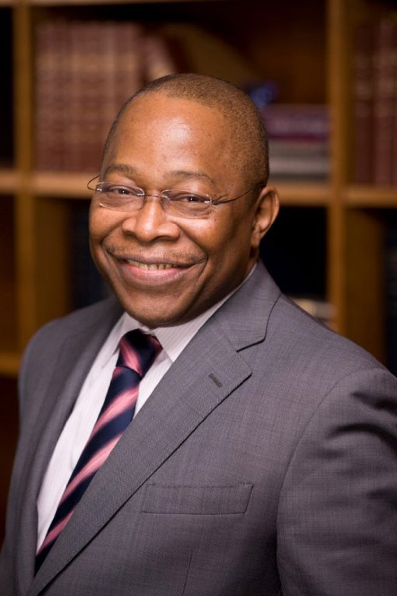
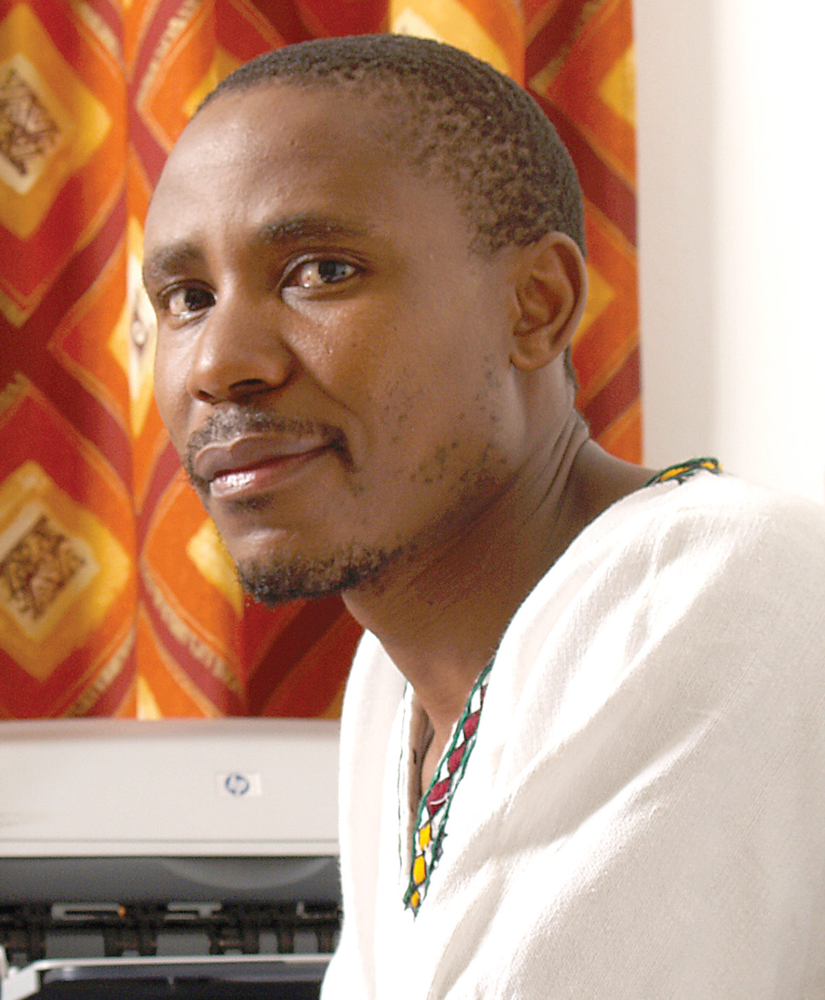

## **The Context and Politics of African Philanthropy**

### Tade Akin Aina & Bhekinkosi Moyo (Eds.)

In the past decade, the emerging narratives about philanthropy in Africa are about an increasingly confident and knowledgeable assertion of African capacities to give not only to help but also to transform and seek to address the root causes of injustice, want, ignorance and disease. The narratives are also about the questioning of the role and place of Africans in the world’s philanthropic traditions and what constitutes African specificities but also African differences and varieties.

*Giving to Help, Helping to Give* deftly explores African philanthropic experiences, their varieties, challenges and opportunities. It is about documenting, investigating, describing, analysing and reflecting on philanthropy in Africa. This ground-breaking book rightly tackles the varied modes, forms, vehicles and means in which philanthropy is expressed in multifaceted Africa.

It is a pioneering and ambitious effort in a field and community of practice that is new both in terms of scholarship and in professional practice. Many of the chapters boldly engage the burden of reflections, questions, ambivalences and ambiguities that one often finds in an emerging field, innovatively positing the outlines, concepts, frameworks and theories of scholarship and practice for a field critical to development on the continent.

**Contributors:** Tade Akin Aina • Mohammed A. Bakari • Bertha Chiroro • Kwaku Asante Darko • Marwa El Daly • Alan Fowler • Ibrahima Hathie • Jenny Hodgson • Andrew Kingman • Christa L. Kuljian • Halima Mahomed • Bhekinkosi Moyo • Robert Muponde • James Muzondidya • Connie Ngondi-Houghton • Kayode Samuel • Fondo Sikod • Mohamadou Sy • Gérard Tchouassi • Susan Wilkinson-Maposa • Saïda Yahya-Othman

### Author Details

**Tade Akin Aina,** currently the Program Director, Higher Education and Libraries in Africa for the Carnegie Corporation of New York, studied Sociology at the University of Lagos, Nigeria, and Sociology of Development at the London School of Economics, and holds a Doctor of Philosophy from the University of Sussex, UK. He served as Deputy Executive Secretary (publications) at CODESRIA, Dakar, Senegal from 1993 to 1998, and worked with the Ford Foundation in the Nairobi office from 1998 to 2008. He has also served as Consultant for many agencies including UNDP, UNICEF, UN-HABITAT, United Nations University and The World Bank on a wide range of development issues such as urban poverty, higher education reform, governance, environment and development. He currently serves on the boards of Winrock International, Seeding Labs, the King Baudouin Foundation, and the Kenya Human Rights Commission among others. Tade Akin Aina has authored and co-edited more than ten books/monographs and numerous chapters in books, articles in journals and learned publications, and several conference papers and addresses.

**Bhekinkosi Moyo** is Director of Programs at TrustAfrica, based in Dakar, Senegal. He holds a doctorate in political science from the University of the Witwatersrand in South Africa. He previously worked at the Africa Institute of South Africa, Tswaranang Legal Advocacy Centre and at the Institute for Democracy in South Africa. He has written and published extensively on governance, democratization and philanthropy in Africa. He has edited several books that include, *Africa in the Global Power Play: Debates, Challenges and Potential Reforms* (2007), and *(Dis) Enabling the Public Sphere: Civil Society Regulation in Africa* (2010).