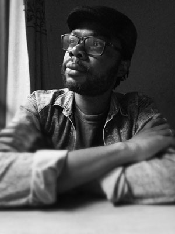

## Paul Kisakye

### Sarraounia Prize for Young Adult Fiction 2020

Fifteen-year-old Tendo Katende was looking forward to the holidays and a break from schoolwork, but two weeks in he can’t stand the routine of playing video games all day long any more. Will the rest of the holiday be like this? Then a visit from an uncle he has never met before changes everything. Uncle Moses comes with a gift of a holographic video game like none Tendo has ever played before.

When strange happenings at the farm start causing havoc, mayhem and destruction, Tendo gets into serious trouble with his father, concerned about the game’s power. Is the new holographic game linked to the mysterious events at the farm? Does that mean Tendo needs to stop playing his super-fun, highly addictive video game if he is to save the farm? What if there are more sinister forces with vindictive agendas at work on the farm? Suddenly, the holidays are no longer boring, Tendo teams up with his friends to solve the mystery before the whole farm is destroyed.

The Sarraounia Prize for Young Adult Fiction is founded by the **Arts & Culture programme at Abdou Moumouni University,** Niger and the publisher **Amalion,** Senegal to contribute to the availability of reading material for African young adults and to promote literature to help better understand the world of African youths. Every two years, the Sarraounia Prize will be awarded to the best unpublished fiction for young adults written in English, French or Hausa by African authors and illustrators based in Africa.

### Author Details

**Paul Kisakye** is a Ugandan-born writer, editor and writing coach. He is the author of *Tech Explorers League*, a series of sci-fi novels for children; and a non-fiction book *Prodigal Love*. He is an African Writers Trust Publishing Fellow and was shortlisted for the Writivism Short Story Prize in 2013 for his piece, “Emotional Roller Coaster”.