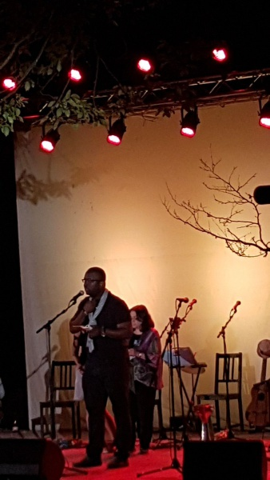

Sète, cette commune du département de l’Hérault en Occitanie dans le Sud de la France, accueille chaque année l’un des plus grands festivals de poésie au monde. En juillet 2017, le Festival Voix Vives de Méditerranée fêtait sa 20e édition et sa 8e édition à Sète. La sélection des auteurs invités permet d’accueillir à Sète les grands noms et les voix émergentes de la poésie méditerranéenne, représentatifs de toutes les tendances de la poésie contemporaine. Plus de 100 poètes et des artistes venus de toutes les Méditerranée : Méditerranée latine, d’Afrique, des Balkans, d’Orient ou encore de celle que l’Histoire a « exportée » dans le monde (Amérique du Sud, Amérique centrale, Afrique de l’Ouest, Francophonie…) y sont conviés.

Pour l’édition 2017, l’auteur sénégalais Ibrahima Amadou Niang dont le recueil de poèmes *[Les Raisins du baobab](http://www.amalion.net/catalogue_en/item/les_raisins_du_baobab/ "Les Raisins du baobab")* (publié chez Amalion) a été invité au Festival en tant que voix africaine émergente. Cette voix de l’Afrique dans ce grand rendez-vous de la méditerranée a raisonné au cours de 6 évènements: Lecture/débat: un poète et son diffuseur; lecture poétique et musicale à Capriccio; Lecture intimiste en mer; Lecture musicale sur le parvis de l’église Saint-Louis; De voix en voix à la Place du Livre ; Spectacle de Clôture au Parc Simone Veil. Durant ces échanges avec le public du Festival, dans divers lieux, Ibrahima Amadou Niang a souligné les aspects féconds de la culture africaine  et a échangé des points de vue sur les questions de démocratie, d’engagement et de valorisation des contributions africaines.

Pour l’auteur, il y a un certain nombre d’enseignements à tirer de ces échanges. Lepremier est que la valorisation du patrimoine linguistique (langues et dialectes africains) est une nécessité et constitue le point de départ  pour la construction d’un discours authentique et attractif. Le deuxième est que l’Afrique est encore méconnue à travers le monde et un certain nombre de clichés perdurent à son sujet. Le troisième et dernier est que la poésie demeure un genre privilégié et adapté pour construire et véhiculer un discours  sur l’Afrique. Son passage à Sète a été fortement apprécié et ses interventions ont marqué les esprits.