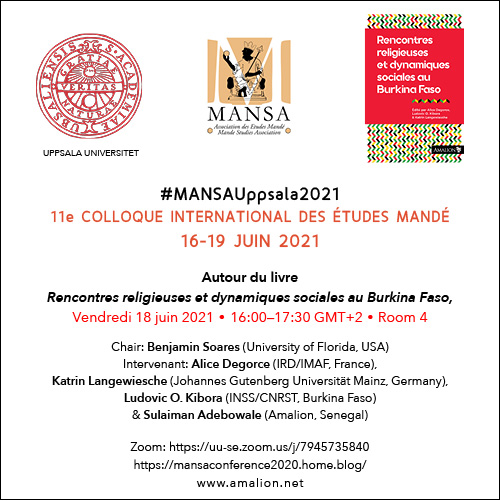

## 11e Colloque International des Études Mandé, 

16-19 juin 2021

Autour du livre: *Rencontres religieuses et dynamiques sociales au Burkina Faso*

Vendredi 18 juin 2021 • 16:00–17:30 GMT+2 • Room 4.

Chair: Benjamin Soares,

Intervenant: Alice Degorce, Katrin Langewiesche, Ludovic O. Kibora & Sulaiman Adebowale

Zoom: <https://uu-se.zoom.us/j/7945735840>