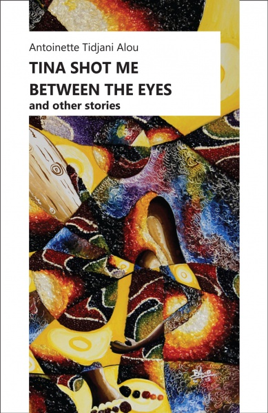

## Prairie Lights, Iowa City, USA

### Tuesday 7 PM CST (Wed 1 AM GMT)

Antoinette Tidjani Alou will talk about the theme of writing life: memoir, fiction, memo-fiction in her books ***[Tina Shot me Between the Eyes](http://www.amalion.net/catalogue_en/item/tina_shot_me_between_the_eyes_and_other_stories/ "Tina Shot Me Between the Eyes")*** and ***On m’appelle Nina.*** In fifteen formidable lyrical prose pieces, ***Tina Shot Me Between the Eyes*** explores how the self is shaped and transformed by the knots we yearn to tie around ourselves: familial, spousal, parental, and societal. ***On m’appelle Nina***, a memoir in French, centers on the story of Vilhelmina, a woman who leaves her home island—Jamaica—to settle down in Niger for love.

A binational citizen of Jamaica and Niger, Antoinette Tidjani Alou is a Professor of French and Comparative Literature and Director of the Arts and Culture Programme at the Université Abdou Moumouni de Niamey in Niger, where she has lived for more than twenty-five years. An independent translator, she has published several articles and books. She is currently a resident of the International Writing Programme. This event will include readings in English and French.

For further info, see [Prairie Lights](http://www.prairielights.com/live "Prairie Lights")