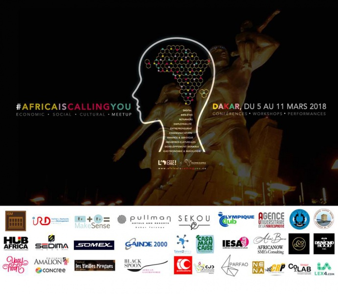

Louis Camara (Le Choix de l'Ori and Iyéwa) and Ayesha Harruna Attah will participate at a literary conversation and performance forum at the #AICY18 forum organised by the [L'Afrique c'est Chic World](https://www.facebook.com/lAfriqueCchicw/) and [Welcoming Diasporas](https://www.facebook.com/WDiasporas/) from 05 to 11 March 2018 in Dakar, Senegal.

In partnership with HUB Africa and [Institut de recherche pour le développement (IRD)](https://www.facebook.com/IRD.fr/) Dakar, the forum will gather entrepreneurs, startups and mentors for an elevator pitch at the Institut Superieur de management (ISM), talent show contests, conferences and a literary performance with writers Louis Camara and Ayesha Harruna Attah at MakeSenseCampus - IAM Groupe Institut Africain de Management, Dakar on Wednesday 7 March 2018.