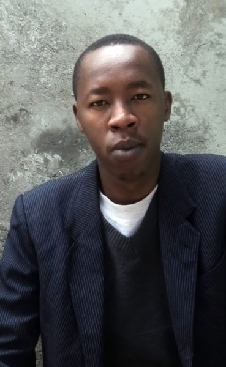

Clifton Gachagua’s manuscript *Madman at Kilifi* has been selected by the African Poetry Book Fund & Series for the Sillerman First Book Prize for African Poets. As the winner of the First Book Prize, Gachagua’s *Madman at Kilifi* will be among one of the four books to be published by the African Poetry Book Series in 2014.

The Sillerman First Book Prize for African Poets is awarded to African poets who have not previously published a book-length collection. The prize includes a $1000 cash award and publication with the University of Nebraska Press and Amalion Publishing in Senegal.

Kwame Dawes, Series Editor of the African Poetry Book Fund & Series, notes that *Madman at Kilifi* was selected because, “Above all, there is a distinctive voice here. This is a difficult trait to define, but when it emerges as it does here, it is striking for its originality. There is a fresh and adventurous intelligence and delight in Gachagua’s poems. The judges are all thrilled with this manuscript and we are expecting great things from Clifton Gachagua."

Clifton Gachagua is a writer, screenwriter, and filmmaker based in Nairobi, Kenya, where he was born and raised. Gachagua’s poetry has appeared in *Kwani? 06*, *Saraba*,andon his blog“The Drums of Shostakovich.” His prose has appeared in the online journal *Storymoja*, and the anthology *AfroSF,* a collection of science fiction writing from Africa. He has recently completed a novel and is currently developing a French-Nigerian feature-length film. He holds a bachelor’s degree in biomedical sciences.

The Sillerman First Book Prize is named after philanthropists Laura and Robert F.X. Sillerman whose contributions have endowed the establishment of the African Poetry Book Fund & Series to promote the writing and publication of African poetry through an international complex of collaborations and partnerships. The Fund and its partners offer support for seminars, workshops, and other publishing opportunities for African poets.

The University of Nebraska-Lincoln’s literary journal *Prairie Schooner* manages the annual Sillerman First Book Prize for African Poets as a partner in the African Poetry Book Fund & Series.

In addition to Dawes, the Series Editor, who is of Ghanaian birth, the editorial board for the African First Book Fund is comprised of the South African poet Gabeba Baderoon,the American novelist John Keene*,* the Nigerian poet and novelistChris Abani, the Egyptian-American poet Matthew Shenoda, and Bernardine Evaristo, award-winning novelist, and poet from the UK.