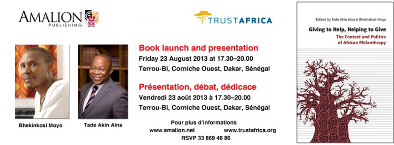

**Book Launch**

Amalion Publishing and TrustAfrica cordially invite you to the launch of "[Giving to Help, Helping to Give: The Context and Politics of African Philanthropy](http://www.amalion.net/?URL=HTTP%3A%2F%2Fwww.amalion.net%2Fcatalogue_en%2Fitem%2Fgiving_to_help_helping_to_give%2F%2522title%3D%2522Giving "Giving to Help")" Edited by Tade Akin Aina and Bhekinkosi Moyo.

Date: Friday **23 August 2013** from **17.30 to 20.00**

Venue: Terrou-Bi, Route de la Corniche, Dakar, Senegal.

RSVP

Contact: Tel: 33 869 46 86 (TrustAfrica)

Contact: Tel: 33 860 19 04 (Amalion)

**Présentation et dédicace**

Éditions Amalion et TrustAfrica ont le plaisir de vous inviter à la présentation du livre : "[Giving to Help, Helping to Give: The Context and Politics of African Philanthropy](http://www.amalion.net/?URL=HTTP%3A%2F%2Fwww.amalion.net%2Fcatalogue_en%2Fitem%2Fgiving_to_help_helping_to_give%2F%2522title%3D%2522Giving "Giving to Help")" sous la direction de Tade Akin Aina et Bhekinkosi Moyo.

Date: Vendredi **23 août 2013** de **17.30h à 20h**

Lieu: Terrou-Bi, Route de la Corniche, Dakar, Sénégal.

RSVP

Contact: Tel: 33 869 46 86 (TrustAfrica)

Contact: Tel: 33 860 19 04 (Amalion)