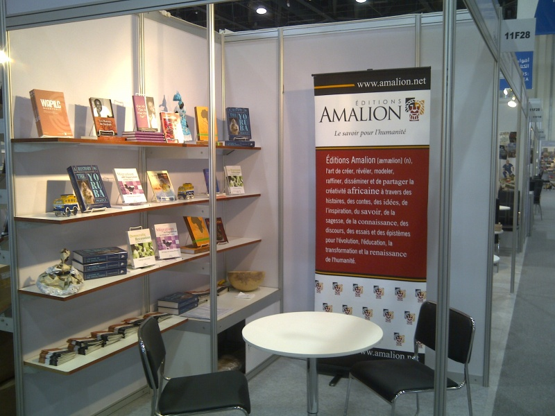

Amalion Publishing was at the Abu Dhabi International Book Fair in the United Arab Emirates from 15 to 20 March 2011. The ADIBF is one of the largest in the Middle East and a good venue for connections with publishers and industry contacts in the Arab World and Asia. Officially, we sold books, got rights and made valuable contacts with other publishers and distributors on interesting possibilities to reconnect our literary cultures, which Africa and the Arab World used to do thousands of years previously. Okay, what did we do unofficially?

How about a visit to a hospital for falcons, gawking at the marvel and opulence of the Sheikh Zayed Grand Mosque and tasting kunafa, shaybiyat, baqlava and nicely decorated dates you will be too sad to destroy by eating. Did we include attending one of the richest literary awards ceremonies in the world? The Sheikh Zayed Book Award, totalling AED 7 million, rewards "writers, intellectuals, publishers as well as a young talent whose writings and translations of humanities have scholarly and objectively enriched Arab cultural, literary and social life".   

We gratefully acknowledge the support of Kitab for making our visit possible. Kitab, which means 'book' in Arabic, is an organisation working to develop the book and publishing industry in the Arab world. For more info on their great work see [Kitab](http://www.kitab.ae/en/ "kitab").