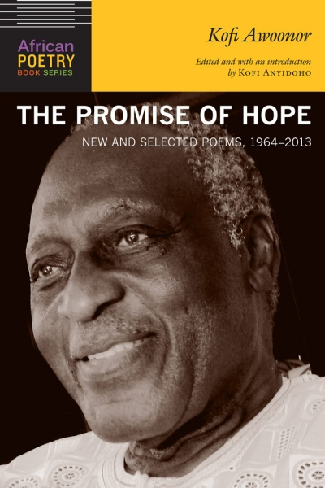

We are saddened to announce the passing of distinguished poet and novelist Kofi Awoonor. He died in the terrorist attack by al-Shabaab militants at the Westgate shopping mall on 21 September 2013 in Nairobi, Kenya.

Born George Awoonor Williams on 13 March 1935 in Wheta, the southeastern part of Ghana, **Kofi Nyidevu Awoonor** was a diplomat, a professor of comparative literature at numerous universities, and recently retired from teaching full-time in the Department of English at the University of Ghana.

He published several volumes of poetry, including *Rediscovery and Other Poems* (1964), under his initial name George Awoonor Williams, *Night of My Blood* (1971), *Ride Me, Memory* (1973), *The House by the Sea* (1978) a product of his time as a political prisoner without trial, and *The Latin American and Caribbean Notebook* (1992). His collected poems (through 1985) were published in *Until the Morning After* (1978)*.* He also published two novels *This Earth, My Brother* (1971) and *Voyager at Last* (1992). He studied at the University of Ghana, Legon; University of London, UK; and SUNY in the US.

A state memorial service will be held on 11 October and a final laying to rest on 9 November 2013 in his hometown, Wheta, Ghana. He is survived by his wife and six children.

For more info on his life and writing, see the following links:

[Soyinka, Clark, Osofisan and other Nigerian writers mourn Awoonor:](http://tribune.com.ng/news2013/index.php/en/features2/item/23242-%E2%80%98his-scalp-was-root-to-a-unique-brain-they-can-never-replace%E2%80%99.html)

A recording of [Kofi Awoonor reading his poetry on the BBC](http://www.bbc.co.uk/news/world-africa-24215638) 

[Telegraph](http://www.telegraph.co.uk/news/worldnews/africaandindianocean/kenya/10326144/Kofi-Awoonor-Ghanaian-poet-killed-in-Westgate-Attack.html) <http://www.telegraph.co.uk/news/worldnews/africaandindianocean/kenya/10326144/Kofi-Awoonor-Ghanaian-poet-killed-in-Westgate-Attack.html>

[New Yorker](http://www.newyorker.com/online/blogs/books/2013/09/i-will-say-it-before-death-comes-the-murder-of-kofi-awoonor.html) <http://www.newyorker.com/online/blogs/books/2013/09/i-will-say-it-before-death-comes-the-murder-of-kofi-awoonor.html>

[Wall Street Journal](http://blogs.wsj.com/speakeasy/2013/09/22/poet-kofi-awoonor-killed-in-terrorist-attack-at-nairobi-mall/) <http://blogs.wsj.com/speakeasy/2013/09/22/poet-kofi-awoonor-killed-in-terrorist-attack-at-nairobi-mall/>

[University World News](http://www.universityworldnews.com/article.php?story=20130927152254942) <http://www.universityworldnews.com/article.php?story=20130927152254942>

[The Guardian](http://www.theguardian.com/books/2013/sep/28/kofi-awoonor-nii-parkes-hero) <http://www.theguardian.com/books/2013/sep/28/kofi-awoonor-nii-parkes-hero>

[The Guardian](http://www.theguardian.com/world/2013/sep/23/kofi-awoonor) <http://www.theguardian.com/world/2013/sep/23/kofi-awoonor>

[Kofi Awoonor, Guardian Of The Sacred Word ](http://saharareporters.com/article/kofi-awoonor-guardian-sacred-word-niyi-osundare)By Niyi Osundare

Awoonor's new collection, *[The Promise of Hope: New and Selected Poems, 1964–2013,](http://www.amalion.net/catalogue_en/item/the_promise_of_hope/)* to be released in 2014 by the University of Nebraska Press and Amalion Publishing