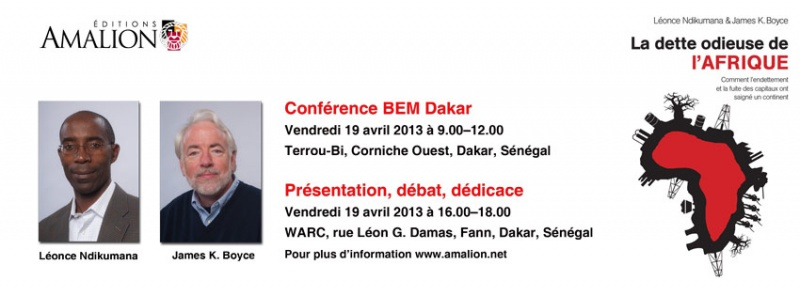

**Conférence**

BEM Dakar et Éditions Amalion ont le plaisir de vous inviter à la conférence-débat sur le livre : "[La dette odieuse de l’Afrique: Comment l'endettement et la fuite des capitaux ont saigné un continent](http://www.amalion.net/catalogue_en/item/la_dette_odieuse_de_lafrique/ "La dette odieuse de l'afrique")" écrit par Léonce Ndikumana et James K. Boyce.

Date: Vendredi **19 avril 2013** de **9h à 12h**

Lieu: Terrou-Bi, Route de la Corniche, Dakar, Sénégal.

Contact: Tel: 33 869 82 21 / 77 388 12 16 (Malick Faye, BEM)

Contact: Tel: 33 860 19 04 (Amalion)

**Présentation, Débat et dédicace**

Le Centre de Recherche Ouest Africain / West African Research Center (WARC) en collaboration avec Éditions Amalion vous convie à la présentation et à la dédicace de l’ouvrage intitulé "[La dette odieuse de l’Afrique: Comment l'endettement et la fuite des capitaux ont saigné un continent](http://www.amalion.net/catalogue_en/item/la_dette_odieuse_de_lafrique/ "La dette odieuse de l'Afrique")"écrit par Léonce Ndikumana et James K. Boyce.

Date: Vendredi **19 avril 2013** à partir de **16h précises**

Lieu: Centre de Recherche Ouest Africain (WARC), Rue E x Léon Gontran Damas, Fann Résidence, Face Direction Ageroute, CSE ou DHL, Dakar, Sénégal.

Contact Tel : 33 865 22 77 (WARC)

Contact Tel : 33 860 19 04 (Amalion)

Les exemplaires du livre dédicacé par les auteurs seront disponibles à vendre.

Plus d'information [voir](http://www.amalion.net/catalogue_en/item/la_dette_odieuse_de_lafrique/ "La dette odieuse de l'Afrique")