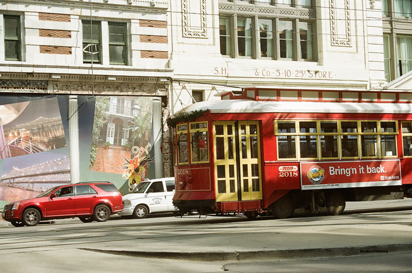

Saints and scholars went marching in the African city of New Orleans, the USA for the 52nd Annual Meeting of the [African Studies Association](http://www.africanstudies.org/ "ASA") from 18–22 November 2009 in support of a city rebuilding itself from the painful winds of Katrina.

As the largest forum for African Studies held in North America, the ASA provided an opportunity for Amalion Publishing to meet hundreds of scholars and professionals from the world involved in the quest for knowledge on Africa. The year's theme 'Africa at a Cross roads' encapsulates the challenges in the multi-tiered paths for Africa at the threshold of a complex age.

Key highlights of the forum included the Basorun M.K.O. Abiola Lecture delivered by the distinguished social policy scholar Omotade Akin-Aina, and the recognition of Sylvester Okwunodu Ogbechie's work *Ben Enwonwu: The Making of an African Modernist* (University of Rochester Press, 2008) as the Melville J. Herskovits Prize Award Winner for 2009.

For an organization doing work in the New Orleans area, particularly the Ninth Ward, see [Common Ground Relief](http://www.commongroundrelief.org/ "Common Ground")