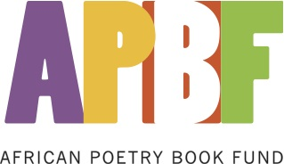

Kwame Dawes, Guggenheim Fellow, and winner of the 2011 Barnes & Noble Writers for Writers Awardis pleased toannounce the establishment of the African Poetry Book Fund. Starting in January 2014, the Series will publish four new titles by African poets each year. In addition, the Series will publish an anthology every few years representing themes, ideas, and poets from across the African continent. Of the four books published, one will be a winner of the Sillerman First Book Prize for African Poets, and the second will be a new and selected volume by a major African poet. The winner of the Sillerman prize will also receive $1000 in cash.

Ghanaian poet, Kofi Awoonor, is honored to be the first major poet in the Series. His new and selected poems, with an introduction by fellow poet and scholar, Kofi Anyidoho, will be published in 2014.

This new, exciting Series has been made possible through seed funding from philanthropists, Laura and Robert F. X. Sillerman, whose generous contributions have facilitated the establishment of the African Poetry Book Fund. Mr. and Mrs. Sillerman welcome the use of their name for the Sillerman First Book Prize for African Poets.

The African Poetry Book Series will be the central feature of the work of the African Poetry Book Fund, established in July 2012 under Dawes’ leadership at the University of Nebraska-Lincoln. An Advisory Board has been established to support and guide the work of the African Poetry Book Fund. Confirmed Board Members include Laura Sillerman (President, The Tomorrow Foundation), Sulaiman Adebowale (Publisher, Amalion Publishing), Elizabeth Alexander (poet), Ellah Allfrey (Dep. Director, Granta magazine), Russell L. Goings (Poet, entrepreneur,) and Glenna Luschei (Poet, editor, and translator) and Peter Rorvik (Director, Centre for Creative Arts, South Africa).

Six internationally renowned writers serve on the Editorial Board for the Series. Ghanaian-born poet Kwame Dawes, as the founding Series Editor;South African poet Gabeba Baderoon;American novelist John Keene;Nigerian poet and novelistChris Abani; Egyptian-American poet Matthew Shenoda; and British-Nigerian poet Bernardine Evaristo. For bios of editorial board members, [click](http://www.amalion.net/resources/APBS_Editorial-Board-bios.pdf "African Poetry Book Series Editorial Board")

**Key Partners**

* University of Nebraska Press in the USA and Amalion Publishing in Senegal will ensure that the books are published, distributed, and available worldwide in a collaborative venture.
* *Prairie Schooner,* the acclaimed literary journal, will be a key partner in this project offering administrative support and the management of the Sillerman First Book Prize for African Poets.
* Open Road Media, a digital publisher, and multimedia company led by Jane Friedman will handle the digital and e-books for the African Poetry Book Series.
* Blue Flower Arts, a leading booking agency for artists will represent the authors and promote the Series.
* The Brunel University African Poetry Prize for a portfolio of poems. Spearheaded by poet and novelist Bernardine Evaristo, the Brunel University African Poetry Prize will offer a cash award and publication in major international literary journals. For submission guidelines and additional info on this prize, see <http://www.africanpoetryprize.org/rules>

The African Poetry Book Fund with its key partners will also undertake to promote the writing and publication of African poetry through other international collaborations and partnerships, seminars, workshops, and other publishing opportunities for African poets.

 

**Submissions will be accepted from September 15th – November 15th, 2012.**

 

**For general queries regarding the African Poetry Book Fund and Series contact:**

Marianne Kunkel\
Managing Editor, African Poetry Book Fund and Series\
Rm. 123 Andrews Hall\
University of Nebraska\
Lincoln, NE, 68588 USA

Email: Prairieschooner(a)unl.edu\
http://africanpoetrybf.unl.edu

 

**For additional information about Amalion Publishing contact:**

Sulaiman AdebowaleAmalion Publishing\
133 Cité Assemblée Ouakam\
BP 5637 Dakar-Fann\
Dakar, Senegal

Tel: +221 338601904\
Email: publish(a)amalion.net

http://www.amalion.net\
http://www.twitter.com/amalion\
http://www.facebook.com/AmalionPublishing