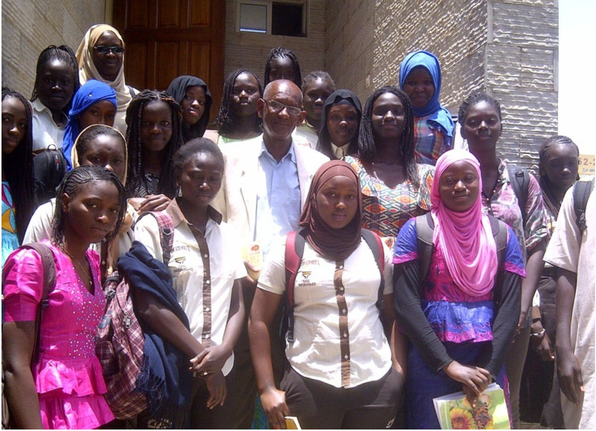

Le 13 mai 2016, le Lycée Thierno Saïdou Nourou Tall de Dakar a accueilli l’écrivain Louis Camara, lauréat du Grand Prix du président de la république pour les lettres. Il était accompagné de Sulaiman Adebowale, directeur de la maison d’édition Amalion. Plus de deux cents élèves de la classe de Seconde et enseignants ont assisté à une journée merveilleuse à l’amphithéâtre de la FASTEF pour s’immerger dans le monde mythique et fantasmagorique du conte « [Le Choix de l’Ori](http://www.amalion.net/catalogue_en/item/le_choix_de_lori/) » révisé et réédité chez Amalion en 2015. 

La journée a commencé par la projection de  "Louis Camara, un Saint-Louisien de coeur et de plume". Un documentaire réalisé par l'Association "Un livre, des auteurs" et diffusé par Téléssonne, qui retrace la pensée artistique de l’auteur.

Ensuite, pour mieux comprendre l’univers de l’écriture de Louis Camara, les élèves ont eu droit à une initiation sur l’orthographe et la culture yoruba présentés par M. Adebowale. Cette partie est suivie par un vif échange entre l’audience et l’auteur. C’est avec beaucoup d’intérêts que les élèves du Lycée Saidou Nourou Tall, renommé pour ses exploits dans les domaines scientifiques, ont enrichi les échanges à cette occasion.

Nous remercions l’administration de l’école pour l’organisation de cette journée mémorable.