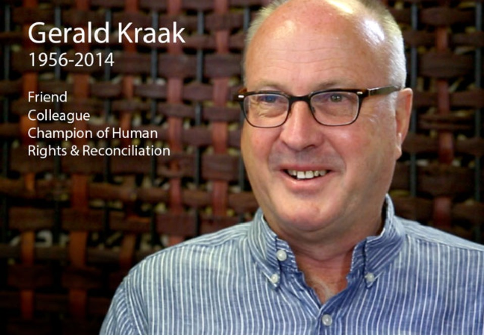

Amalion is pleased to announce its involvement in the new Gerald Kraak Award and Anthology established by Jacana Literary Foundation and The Other Foundation. Created in honor of the anti-apartheid activist, Gerald Kraak (1956–2014), the new award and anthology distinguish writings that explore, interrogate and celebrate the topics of gender, sexuality and human rights. The Gerald Kraak Award for writers and photographers from and about Africa seeks to promote gender identities, human rights and social justice. Jacana Media in association with Amalion Publishing and several publishing houses across the continent will publish an anthology regrouping the very best work shortlisted, with the winners to be announced at a 2017 award ceremony, hosted by The Other Foundation and attended by the authors of the top three submissions. The overall winner will receive a cash prize of ZAR 25 000.

The Gerald Kraak Award 2016 judging panel gathers the gender activist Sisonke Msimang (chair), leading African feminist Sylvia Tamale and the political analyst Eusebius Mckaiser. The closing date for submissions is **31 July 2016.**

For more information on application guidelines and timeline see <http://www.jacana.co.za/awards/gerald-kraak-award-and-anthology>