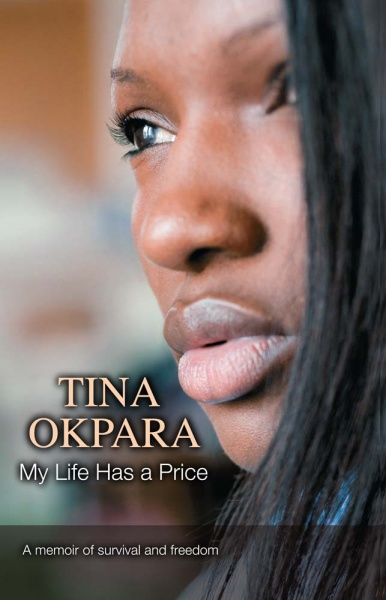

**Book Launch:** *My Life Has a Price* by Tina Okpara

Lagos Book and Art Festival

A panel discussion around the newly released memoir of Tina Okpara and the theme of abuse, rape, and how literature can fill the gap. The book My Life Has a Price (Amalion Publishing: 2012) is being introduced to the public at the 14th Lagos Book & Art Festival. Discussants include Emmanuel Iduma, Adaudo Osigwe, Dami Ajayi, Sylva Nze Ifedigbo moderated by Chris Ihidero. Produced by Saraba Magazine.

Date: **Friday 16 November 2012**

Time: 14.00–15.00 prompt

Venue: Freedom Park, 1 Broad Street/Hospital Road, Lagos, Nigeria

Autographed copies of the book will be available for sale at the venue at a discounted launch price of 2500 naira at the Amalion stand at the fair.

For more info see the [Lagos Book and Art Festival](http://www.coraartfoundation.com/ "14th LABAF Nigeria") or [Saraba Magazine](http://sarabamag.com/ "Saraba Magazine Discussion")

 

**In conversation:** *My Life Has a Price* by Tina Okpara

Lagos Book and Art Festival

Tina Okpara's memoir, MY LIFE HAS A PRICE, takes us on her 5-year journey to hell; from a loving yet poor childhood in Nigeria to the ordeal of modern-day slavery in wealthy, suburban Paris. She was only 13 when celebrity footballer, Godwin Okpara and his wife Linda, lured her father into giving her up for a supposedly better life in Europe. Tina Okpara will share from that experience, especially on writing the memoir and the healing it brings.

Date: **Saturday 17 November 2012**

Time: 10.00–11.45 prompt

Venue: Freedom Park, 1 Broad Street/Hospital Road, Lagos, Nigeria

Autographed copies of the book will be available for sale at the venue at a discounted launch price of 2500 naira at the Amalion stand at the fair.

For more info see the [Lagos Book and Art Festival](http://www.coraartfoundation.com/ "14th LABAF Nigeria")

 

**Book Signing:** *My Life Has a Price* by Tina Okpara

Terra Kulture

Date: **Sunday 18 November 2012**

Time: 15.00–17.30 prompt

Venue: Terra Kulture, Plot 1376 Tiamiyu Savage Street, Victoria Island, Lagos, Nigeria

Autographed copies of the book will be available for sale at a discount launch price of 2500 naira at the venue.

For more info on the venue and how to get there see [Terra Kulture](http://www.terrakulture.com/ "Terra Kulture")

 

**Migration and Children's Rights in Africa and the Diaspora**

Panel Discussion

Date: **Tuesday 20 November 2012**

Time: 11.00–14.00 prompt

Venue: Draper Hall, Institute of African Studies, University of Ibadan, Ibadan, Nigeria

Chair: Prof. Isaac Olawale Albert, Director, Institute of African Studies, Ibadan, Nigeria.

Discussants:

Dr. Willy Eselebor, Institute of African Studies, Ibadan, Nigeria.

Dr. Sola Olorunyomi, Institute of African Studies, Ibadan, Nigeria.

Mrs. Bosede Iro-Nsi, Executive Director, Women’s Rights, and Health Project, Lagos, Nigeria.

MS Tina Okpara, author of My Life Has a Price (Amalion: 2012).

Autographed copies of the book will be available for sale at a discounted launch price of 2500 naira at the venue.

For more background info on the subject, [click](http://www.amalion.net/events_en/item/migration_and_childrens_rights_in_africa_and_the_diaspora/ "Migration and Children's Rights Discussion")