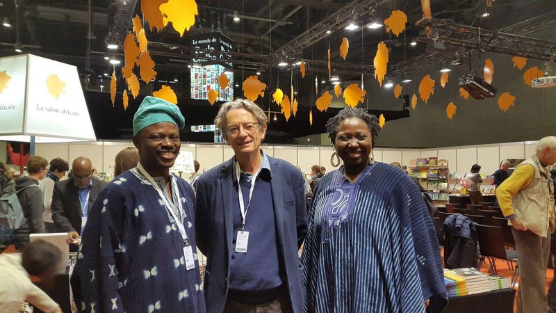

La trentième édition du [Salon international du livre et de la presse de Genève](http://www.salondulivre.ch/fr/) qui s’est tenue à Palexpo du 27 avril au 1 mai 2016 a vu la participation de nombreux auteurs venus de divers horizons du monde. Au programme de cette grande messe du livre, on retrouvait le Salon africain placé cette année sous le thème « Afrique, patrimoine de l’humanité ». Parmi les exposants présents à cette édition, on peut citer la Côte d’Ivoire, le Togo, le Burkina Faso, le Congo, le Cameroun, le Sénégal, et la Tunisie comme pays d’honneur.

Des professionnels de l’édition et des auteurs venus du continent s’étaient réunis pour débattre de tout ce qui fait la remarquable richesse de l’Afrique, de la préhistoire à nos jours. Ont participé notamment aux échanges, Sulaiman Adebowale, le Directeur d'Amalion et Fatou Kandé-Senghor, l’auteure de l’opus *[Wala Bok](http://www.amalion.net/catalogue_en/item/wala_bok_ou_lhistoire_orale_du_hip_hop_au_senegal/) : Une histoire orale du hip hop au Sénégal* (publié aux Éditions Amalion 2015), qui nous parlaient de la rencontre entre un projet de livre qui témoigne du patrimoine d’une communauté active dans l’évolution de la jeunesse engagée et un éditeur indépendant au Sénégal. Les échanges avec le public ont accentué les procédés d’éditions pour la valorisation d’une histoire contemporaine de nos époques. Le débat fut suivi d’une séance de dédicace.

Fatou Kandé Senghor a aussi participé aux côtés de Rokhaya Diallo, journaliste politique ; de Joss Doszen membre du collectif Palabres autour des arts ; et du bloggeur LaRéus Gangoueus à une discussion riche autour du thème « Afrique génération décomplexée ». Les échanges bien que portés sur un sujet ouvert ont étés enrichi par le regard que chaque participant portait sur la question, en tenant compte de leurs géographies, de leurs réalités respectives. L’interculturel, le rapport entre la diaspora et les élites restées sur le continent sont des questions majeures qui ont été développées lors des discussions. Les différents intervenants s’accordent néanmoins sur un point : la jeune génération à la possibilité d’accéder à une prise de parole pour raconter au monde leur version de l’histoire. Des questions demeurent même si les échanges de cette journée ont montré la richesse des réflexions autour du thème.

Amalion remercie les organisateurs du [Salon international du livre et de la presse de Genève](http://www.salondulivre.ch/fr/) pour notre participation à ce forum édifiant pour notre métier.