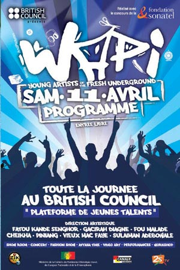

Emotions and ingenuity were high at the grand finale of the Words and Pictures Programme held on April 11, 2009, in Dakar, Senegal. The event was a culmination of months of activities and competition as part of the WaPi project initiated by the [British Council](http://www.britishcouncil.org/africa-news-wapi-senegal.htm "British Council") in collaboration with Fondation Sonatel to provide a platform of expression for new talents in Senegal.

Laureates from literature, visual art, music, fashion, and dance, chosen from a widely publicized competition that drew hundreds of candidates from around the country, participated in the nationally televised event to kick-start the support to bringing them to the wider public. One of the long-term objectives of the program is to contribute to instilling a sense of professionalism in these artists, which could allow them to consider using their talent as a source of livelihood, hence the series of marketing and promotional plans for the winning artists.

Ndèye Maty Kane, a gifted 18-year-old short story writer, emerged winner of the literature section coordinated by Sulaiman Adebowale, a member of the WaPi Board that included the film-maker, Fatou Kandé Senghor; the choreographer, Gacirah Diagne; artist, PiNiang; the designer, Cheikha; and musicians Vieux Mac Faye and Fou Malade.