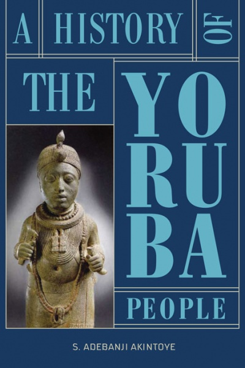

Stephen Adebanji Akintoye's critically acclaimed work *A History of the Yoruba People* is now out in paperback for the first time since release. 

*A History of the Yoruba People* is an audacious comprehensive exploration of the founding and growth of one of the most influential groups in Africa. With a population of nearly 40 million spread across Western Africa and diaspora communities in Europe, the Caribbean, Latin America and North America, Yoruba are one of the most researched groups emanating from Africa. Yet, to date, very few attempts have tried to grapple fully with the historical foundations and development of a group that has contributed to shaping the way African communities are analysed from prehistoric to modern times.

For more details, [see](https://www.amalion.net/catalogue/a-history-of-the-yoruba-people-paperback/)