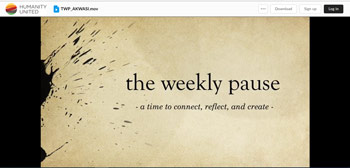

Akwasi Aidoo was a guest of John Paul Lederach on "*The Weekly Pause,* a time to connect, reflect and create" at [Humanity United](https://humanityunited.org/), where he read two poems from the collection *[Rhythms of Dignity](https://www.amalion.net/catalogue/rhythms-of-dignity-poems/)* (Amalion 2020).

Listen to Akwasi's reading [here](https://humanityunited.app.box.com/s/sdd150s7ruv16m51dpxzvjwt86rebhxf){:target="_blank"}. Set to music by Kayso - Flourish Amen.