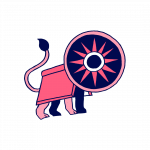

The International Alliance of Independent Publishers held its third Congress from 23–26 November 2021 in Pamplona-Iruñea, Spain.
 

The event, coorganised by the Paris-based [Alliance internationale des éditeurs indépéndants](https://www.alliance-editeurs.org/?lang=fr) and the Asociación de Editores Independientes de Navarra ([EDITARGI](https://www.editargi.com/es)) based in Navare, Spain, gathered independent publishers from Africa, Asia, Europe, and Latin and North America over four days of deliberation on the ethos and issues impacting on the present and future of independent publishing. The lively forum explored questions around bibliodiversity and freedom to publish among others.

")

Amalion’s participation at the conference included exhibiting at the Navarra Book Fair (25–28 November 2021), organized at the Plaza del Castillo right in the centre of the historic bull running Basque city. The collective stand presented the variety and diversity of independent publishing internationally.