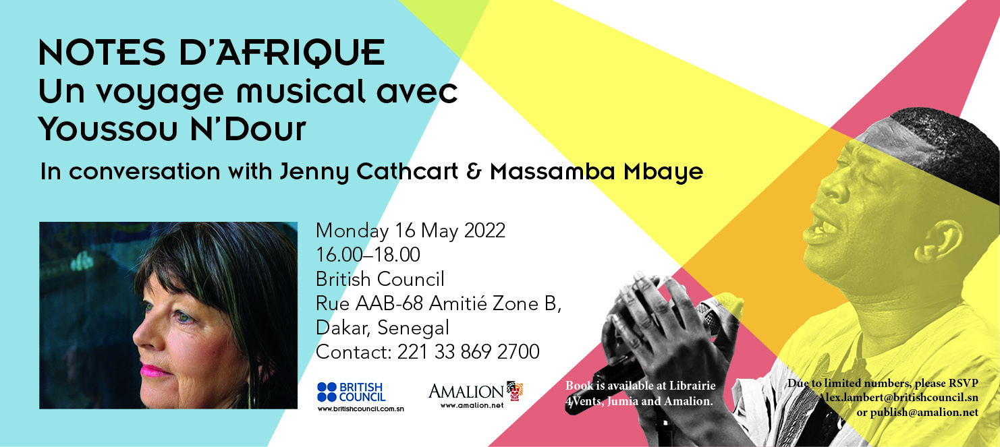

Notes d'Afrique: un voyage musical avec Youssou N'Dour

In conversation with Jenny Cathcart & Massamba Mbaye

Monday 16 May 2022
16.00–18.00
[British Council Senegal](https://www.facebook.com/BritishCouncilSenegal/?__cft__[0]=AZVzsZsMmrNaJnIdLEFmOE5v-ebVIuntB2eFngcSCNtjzTqxdmRDTm2aI5wNwrS70vAT3j-ORShiBkZC_Opz1gwm28fdeg5F49mHK_upTk3Moyo4EBsdYSbQLq-DAechupczKAmuXsisfOIoHXuFy98mehtwVq01DwM4NsvYmnPK0-F3I4CLCDuTyZMZ9ghQsWI&__tn__=kK-R)
Rue AAB-68 Amitié Zone B, Dakar, Senegal
Contact: 221 33 869 2700

**Jenny Cathcart** is a music ethnographer and television producer who has worked for the British Broadcasting Corporation (BBC) on pioneering series such as *The Africans* along side Ali Mazrui, *Rhythms of the World*, and *Africa’s Rock n Roll Years* covering music from all around the African continent, and written for publications including *Roots* and *Songlines* magazines. She has managed and worked with several leading African artistes including Orchestra Baobab, Cheikh Lo, Pape & Cheikh and Youssou N’Dour, to whom she consecrated the recently released book *Notes d’Afrique: un voyage musical avec Youssou N’Dour* (Amalion 2022).

**Jenny Cathcart** est une musicologue et réalisatrice qui a travaillé pour la British Broadcasting Corporation (BBC) sur les séries pionnières comme *The Africans* avec Ali Mazrui ; *Rhythms of the World ; le bal et documentaire Africa’s Rock ’n’ Roll Years*, une histoire musicale de l’Afrique d’après les indépendances ;  et la série *The African Rock ’n’ Roll Years.* Elle écrit également pour *Songlines,* la publication sur la musique du monde. Elle a accompagné et travaillé avec plusieurs artistes africaines, dont Youssou N’Dour, Cheikh Lô, l’Orchestra Baobab, et Pape & Cheikh.

**Massamba Mbaye** is an art critic, curator and communication theory historian. He teaches cybernetics, strategic marketing, communication and curatorial practice at the Université Cheikh Anta Diop Dakar, Université Virtuelle du Senegal (UVS), École Nationale des Arts du Sénégal and the Madiba Institute. Previously, he was for more than a decade Managing Director of Dmedia, a group covering television, radio and print media. He is the curator of the Senegal Pavilion at the Dakar Biennale of Contemporary African Art 2022; steering committee member of Dak'art; and is the author of several books on visual arts in Senegal.

**Massamba Mbaye** est un critique d’art, commissaire d’exposition et historien des théories de la communication. Il enseigne la cybernétique, le marketing stratégique, la communication et les pratiques curatoriales à l’Université Cheikh Anta Diop Dakar, l’Université Virtuelle du Sénégal (UVS), à l'École Nationale des Arts du Sénégal et à l'Institut Madiba. Pendant plus d’une décennie Mbaye a été le Directeur Général du groupe Dmedia, un conglomérat de journaux, radio et télévision. Commissaire 2022 du Pavillon du Sénégal, il est membre du Comité d’orientation de Dak’art et est l’auteur de plusieurs ouvrages sur les arts visuels au Sénégal.

Due to limited numbers, please RSVP Alex.lambert@britishcouncil.sn or publish@amalion.net

Book available at [www.jumia.sn](http://www.jumia.sn/?fbclid=IwAR1tBLzjRHy_pr0Z8yac63Mbi1JOe7wDPfXb-dlBCHzsMr_sD_hV0yiS_Fo), [Librairie Aux 4 Vents](https://www.facebook.com/Librairieaux4Vents/?__cft__[0]=AZVzsZsMmrNaJnIdLEFmOE5v-ebVIuntB2eFngcSCNtjzTqxdmRDTm2aI5wNwrS70vAT3j-ORShiBkZC_Opz1gwm28fdeg5F49mHK_upTk3Moyo4EBsdYSbQLq-DAechupczKAmuXsisfOIoHXuFy98mehtwVq01DwM4NsvYmnPK0-F3I4CLCDuTyZMZ9ghQsWI&__tn__=kK-R) and [www.amalion.net](http://www.amalion.net/?fbclid=IwAR35QJmZOzqYgzmYzP3iCrHfqe2Mt7Ocp87sYdqcCuvgv2E-iaVuyiznjUk)